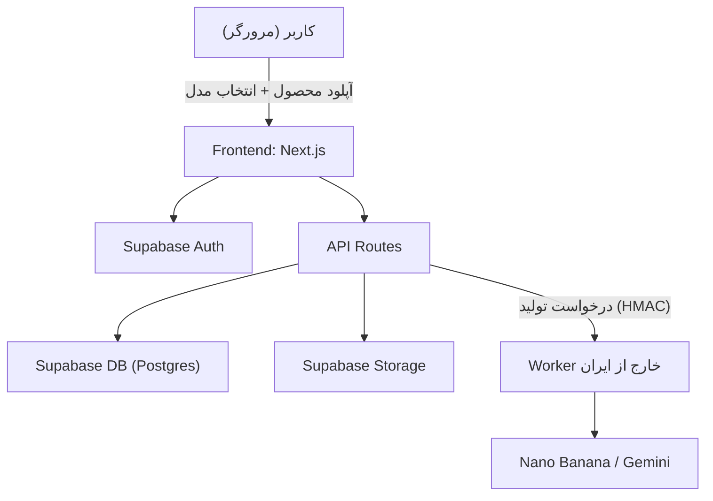

# نقشه‌ی پروژه — سایت ساخت عکس ژورنالی محصول

> خلاصه‌ی جامع از معماری فنی، مدل درآمدی، حل مشکل API و نقشه راه. این سند مرجع داخل پروژه است.

---

## ۱) ایده و مخاطب هدف

سایتی که با کمک قدرتمندترین مدل‌های تصویرسازی (مثل Nano Banana / Gemini)، عکس محصول و مدل کاربر را ترکیب کرده و یک عکس ژورنالی/استودیویی باکیفیت تولید می‌کند.

- **مخاطب هدف:** فروشنده‌های فروشگاه‌های مجازی در اینستاگرام
- **دسته پیشنهادی برای شروع:** کیف و کفش
- **تمایز اصلی:** بومی‌سازی ایران — رابط فارسی، پرداخت ریالی، دورزدن تحریم API، مدل‌های متناسب

---

## ۲) مدل درآمدی (اعتباری / Credit-based)

- ۱ کردیت = ۱ تولید تصویر. کیفیت `standard` برای درافت، `pro` برای خروجی نهایی HD.
- **فرمول واحد اقتصادی:** `قیمت هر کردیت = هزینه دلاری × نرخ ارز × 1.15 ÷ (1 − حاشیه سود هدف)`
- **پلان‌ها:** Free (۱۰ کردیت، واترمارک)، Starter (۱۰۰)، Pro (۳۵۰)، Business (۱۰۰۰).

---

## ۳) معماری فنی

- **فرانت/بک:** Next.js + Tailwind
- **دیتابیس/احراز هویت:** Supabase (Postgres + RLS + Auth)
- **لایه‌ی واسط API:** سرویس Worker مستقل روی سرور خارج از ایران

### پایپ‌لاین تولید
آپلود → حذف پس‌زمینه → انتخاب مدل (آماده/دلخواه) → موتور پرامپت پیشرفته → قفل محصول → draft → HD → کسر کردیت.

---

## ۴) حل مشکل API (تحریم)

کاربر هیچ‌وقت مستقیم با گوگل کار نمی‌کند؛ همه‌ی ارتباط از طریق Worker خارج از ایران با Provider Abstraction و fallback خودکار (Gemini مستقیم → سرویس واسط).

---

## ۵) نقشه راه

- **فاز ۰:** حل API + Worker ✅
- **فاز ۱ (هسته):** Next.js + Supabase، سیستم کردیت، آپلود + حذف پس‌زمینه، گالری مدل، موتور پرامپت پیشرفته ✅ (این نسخه)
- **فاز ۲:** درگاه پرداخت ریالی (زرین‌پال) ✅، داشبورد ✅، هدر مشترک در همه تب‌ها ✅، لوگوی قابل‌ویرایش از پنل مدیر ✅، بلاگ و سئو ✅، سخت‌سازی امنیتی ✅، لانچ بتا
- **فاز ۳:** لباس تنی، مدل اختصاصی، ویدیو

---

## ۶) بلاگ و سئو

- جدول `blog_posts` (اسلاگ یکتا، عنوان، خلاصه، متن، کاور، وضعیت انتشار) با RLS.
- صفحات عمومی `/blog` و `/blog/[slug]` با متادیتای سئو و JSON-LD.
- مدیریت محتوا در `/admin/blog` (ایجاد/ویرایش/حذف/انتشار + آپلود کاور).

## ۷) امنیت

جزئیات کامل در `docs/SECURITY.md`. خلاصه: احراز هویت همه مسیرها، RLS، اعتبارسنجی آپلود (نوع/حجم)، هدرهای امنیتی (HSTS، X-Frame-Options، nosniff، …)، تأیید پرداخت سمت سرور.
